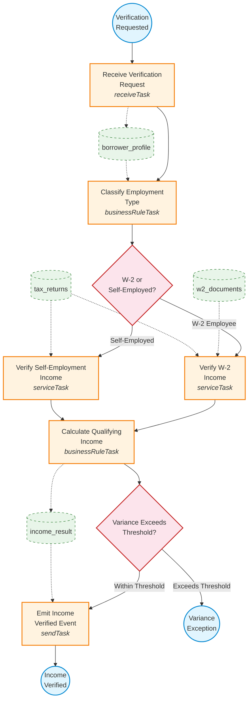

# Income Verification Process Graph

## Lane Assignments

| Lane | Tasks |
|---|---|
| **Underwriting System** | Receive Verification Request, Emit Income Verified Event |
| **Verification Agent** | Classify Employment Type, Verify W-2 Income, Verify Self-Employment Income, Calculate Qualifying Income |

## Data Flow Summary

| Data Object | Produced By | Consumed By |
|---|---|---|
| borrower_profile | Task_ReceiveRequest | Task_ClassifyEmployment |
| tax_returns | External (DocVault) | Task_VerifyW2, Task_VerifySelfEmployment |
| w2_documents | External (DocVault) | Task_VerifyW2 |
| income_result | Task_CalcQualifying | Task_EmitVerified |
