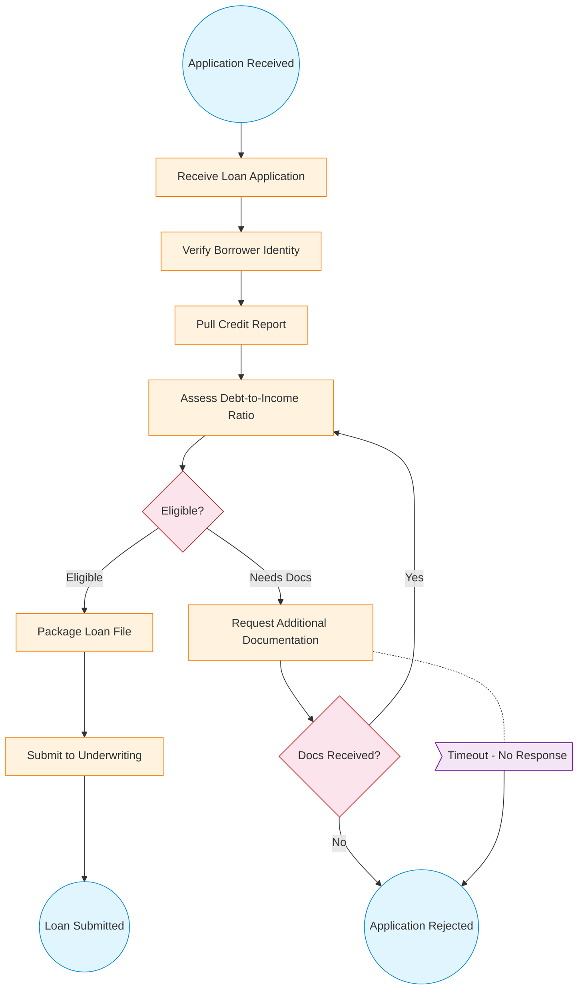

# Loan Origination Process Flow

## Lane Assignment

| Lane | Elements |
|---|---|
| Loan Officer | Start_AppReceived, Task_ReceiveApplication, Task_RequestDocs, Boundary_Timeout, Gateway_DocsReceived |
| Processing Team | Task_PackageLoan, Task_SubmitUW, End_LoanSubmitted |
| Automated Systems | Task_VerifyIdentity, Task_PullCredit, Task_AssessDTI, Gateway_Eligible, End_Rejected |
