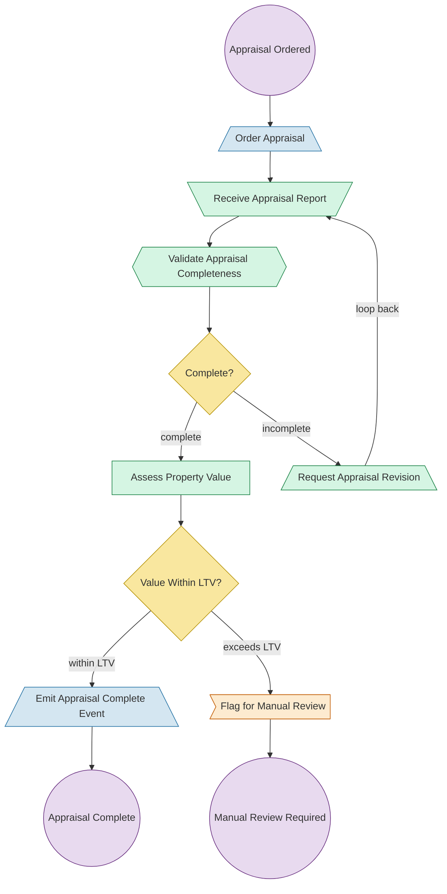

# Property Appraisal Process Flow

## Lane Legend

| Color | Lane | Responsibility |
|-------|------|----------------|
| Blue | Loan Processing | Loan officer activities for ordering and finalizing |
| Green | Appraisal Management | AMC coordination, validation, and value assessment |
| Orange | Underwriting Review | Manual review for LTV exceptions |

## Triple Cross-Reference

| Node | Triple ID | Type |
|------|-----------|------|
| Order Appraisal | PA-ORD-001 | sendTask |
| Receive Appraisal Report | PA-RCV-001 | receiveTask |
| Validate Appraisal Completeness | PA-VAL-001 | businessRuleTask |
| Request Appraisal Revision | PA-REV-001 | sendTask |
| Assess Property Value | PA-ASV-001 | serviceTask |
| Flag for Manual Review | PA-MRV-001 | userTask |
| Emit Appraisal Complete Event | PA-NTF-001 | sendTask |
| Complete? | PA-DEC-001 | exclusiveGateway |
| Value Within LTV? | PA-DEC-002 | exclusiveGateway |
